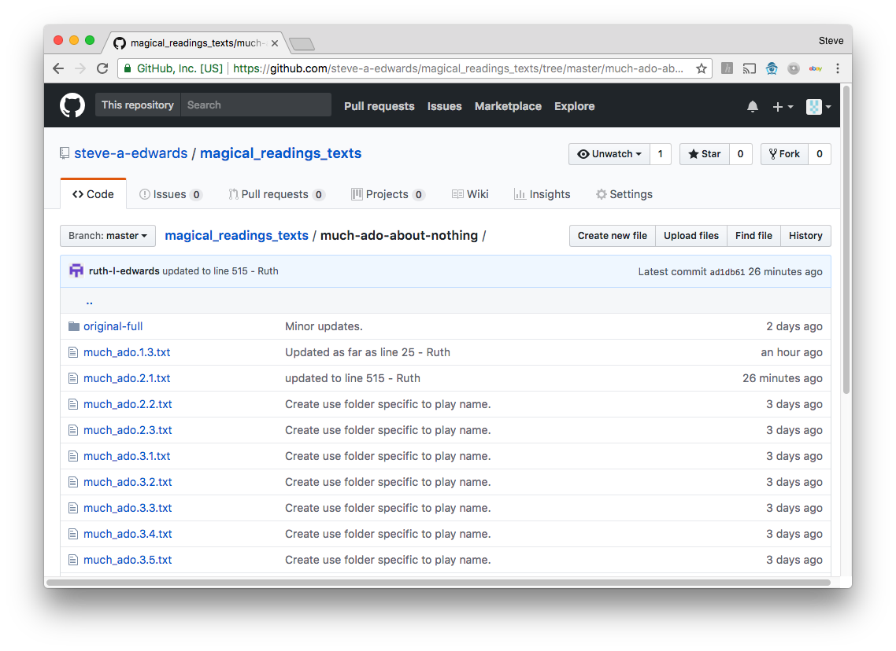
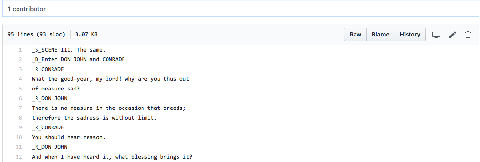
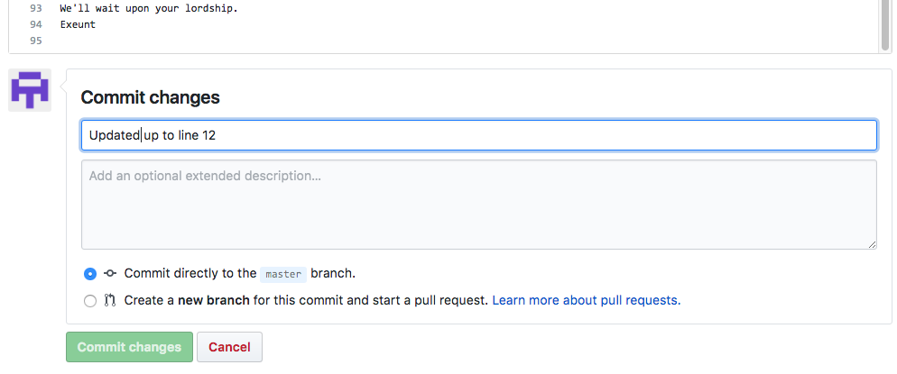

Instructions: 
Web page:   https://github.com/steve-a-edwards/magical_readings_texts 
Sign in:      ruth-l-edwards / HNATRN 
Folder:     much-ado-about-nothing 
Tracking:   track.txt 
Click on file to edit. 
Click the 'pencil' icon top right, to edit the file. 

Editing:
Scene name prefix with    _S_ 
Role name prefix with     _R_ 
Directions prefix with    _D_ 

Save by, at bottom left of page:
- entering a message indicating progress (below 'Commit changes' text) 
- clicking green button bottom left 'Commit Changes'
- the message you enter will be shown in the file list you see later

---
Picture below shows page before login:

 
---
Picture below shows the login page:

 

---
After signing in, go to the folder with the play / scene files:

 
Then click on the filename on the left to edit that file. 
Don't forget to click on the 'pencil' icon top right to star the editing,  
and at the bottom, enter a message, then click the green button.

---
Picture below shows document with line numbers:

 

---
Picture below shows <i>Commit changes</i> section at bottom of page:

 

