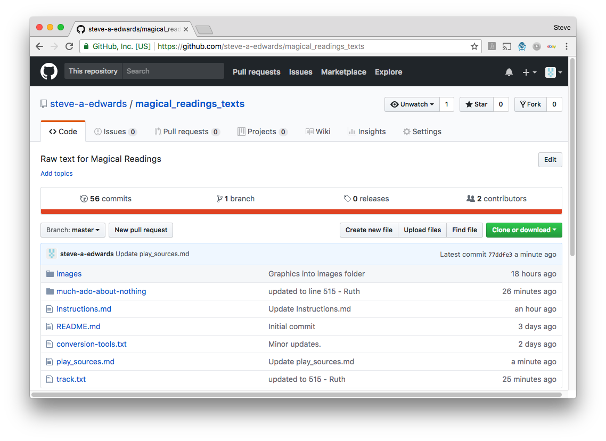
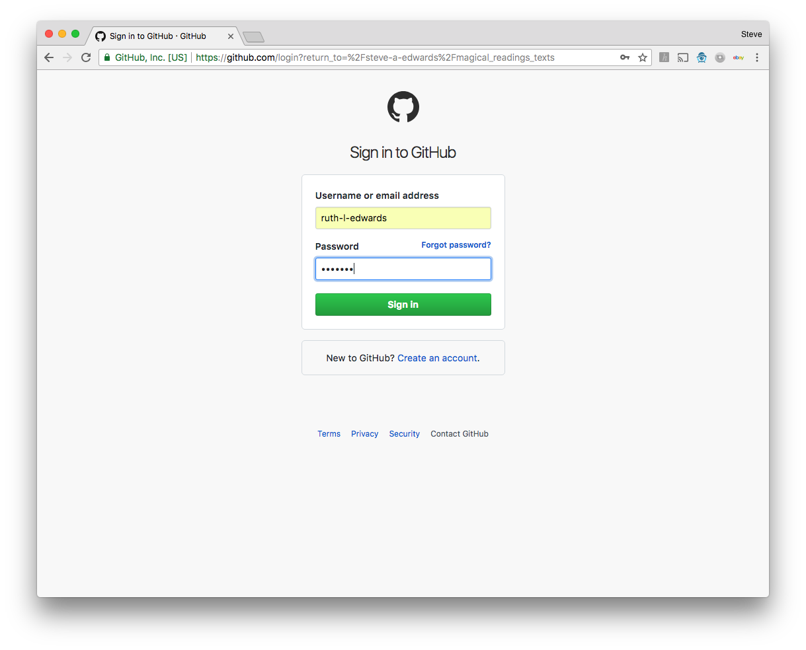
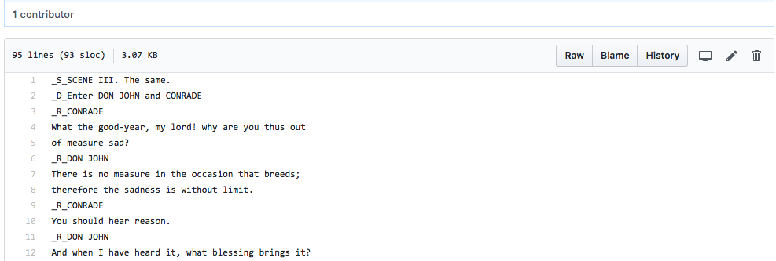
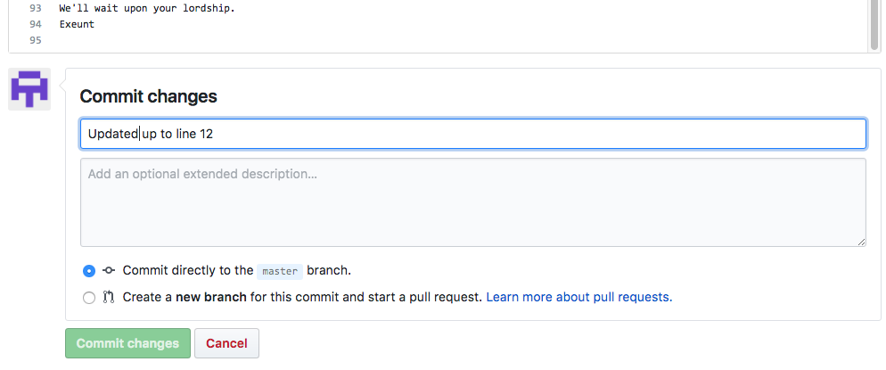

Instructions: 
Web page:   https://github.com/steve-a-edwards/magical_readings_texts 
Login:      ruth-l-edwards / HNATRN 
Folder:     much-ado-about-nothing 
Tracking:   track.txt 
Click on file to edit. 
Click the 'pencil' icon top right, to edit the file. 

Editing:
Scene name prefix with    _S_ 
Role name prefix with     _R_ 
Directions prefix with    _D_ 

Save by, at bottom left of page:
- entering a message indicating progress (below 'Commit changes' text) 
- clicking green button bottom left 'Commit Changes;

Picture below shows page before login:

Picture below shows the login page:

Picture below shows document with line numbers:

Picture below shows <i>Commit changes</i> section at bottom of page:

